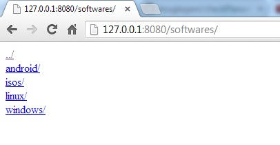
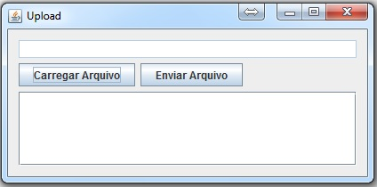

apacheCaseiro
=============

Trabalho feito na disciplina de Redes 2 do curso de Ciência da Computação da Universidade de Itaúna.

O objetivo deste trabalho era aprender sobre o protocolo HTTP bem como o GET E POST, no caso foi desenvolvido um servidor de arquivos semelhante ao do apache, onde foi criado um ServerSocket em Java que ao ser acessado, lista os arquivos do diretório pai, e o restante do seu funcionamento se assemelha ao do servidor de arquivos do apache onde é possível navegador entre os diretórios e baixar arquivos bem como exibir páginas html diretamente no navegador, também foi criada uma pequena aplicação para envio de arquivos para este servidor.

Alguns screenshots.

